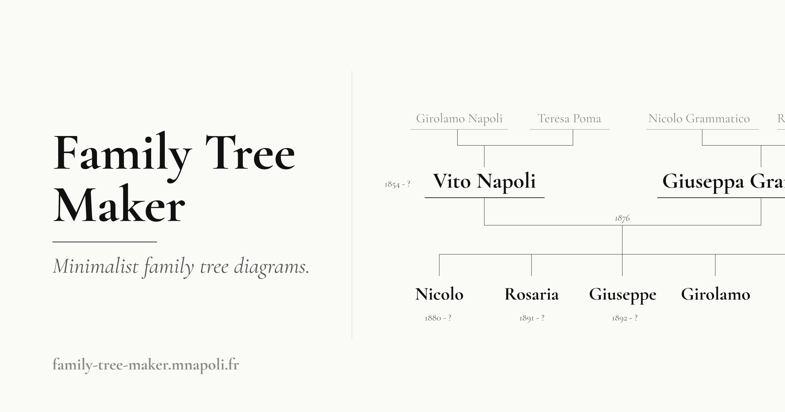

# Family Tree Maker

Render minimalist family tree diagrams:

- Simple web app with PNG export
- HTTP API
- ChatGPT / Claude integration via MCP

**[family-tree-maker.mnapoli.fr](https://family-tree-maker.mnapoli.fr)**

[](https://family-tree-maker.mnapoli.fr)

## Usage

### Web

Use the web UI to create a family tree diagram using the built-in form. The diagram is rendered live as you edit the form, and you can export it as PNG or SVG.

URL: [family-tree-maker.mnapoli.fr](https://family-tree-maker.mnapoli.fr)

### AI agents

Use the remote MCP server to render family trees directly from a conversation with Claude or ChatGPT.

Follow the instructions on this page: [family-tree-maker.mnapoli.fr/mcp](https://family-tree-maker.mnapoli.fr/mcp)

### API

Base URL: `https://family-tree-maker.mnapoli.fr`

- `POST /api/render` — JSON tree → PNG
- `GET /api/tree.svg?d=<encoded>` — SVG
- `GET /api/tree.png?d=<encoded>` — PNG
- `POST /mcp` — remote MCP server (Streamable HTTP, single tool `render_family_tree`)

More details on the API endpoints are available in the [API documentation](https://family-tree-maker.mnapoli.fr/api-docs).

## Development

Runs on Cloudflare Workers: SSR (Hono + React 19), a small HTTP API, and a remote MCP server so Claude / ChatGPT can render trees directly from a conversation.

### Develop

```sh
npm install
npm run fonts   # download the Cormorant Garamond font once
npm run dev
```

Then open http://localhost:8787.

### Build & deploy

```sh
npm run build
npm run deploy
```

Note: [`wrangler.jsonc`](wrangler.jsonc) hardcodes `family-tree-maker.mnapoli.fr` as a custom domain route. If you fork this project, change or remove that route before deploying.

## License

[MIT](LICENSE)
